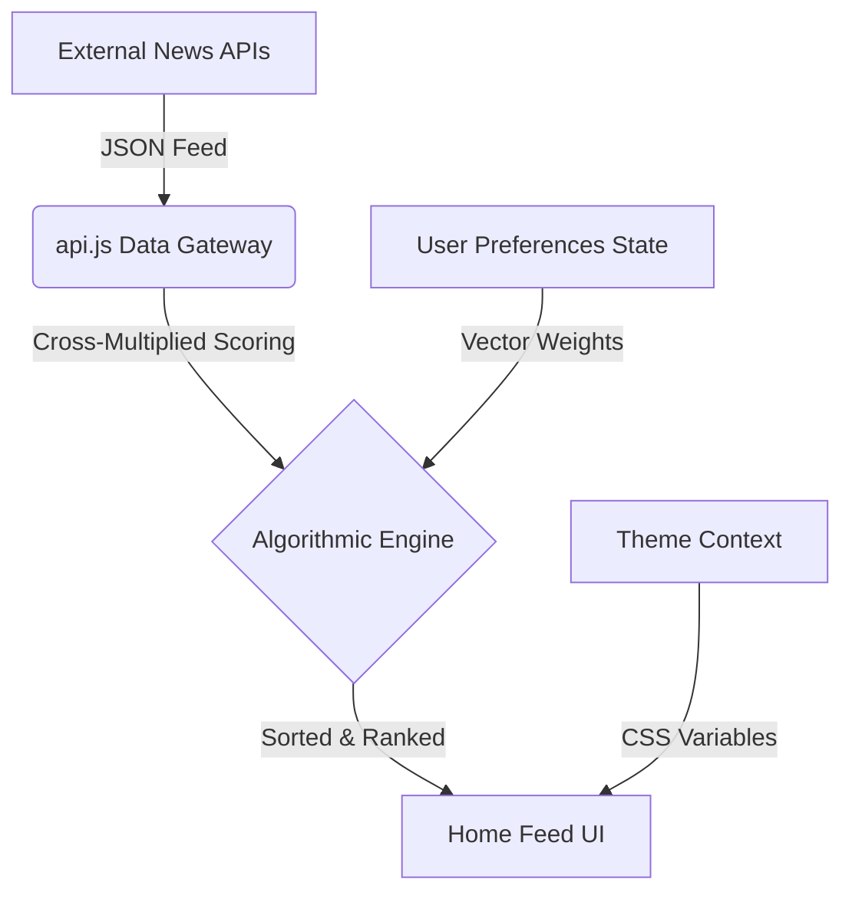

<div align="center">
  
  
  <br />
  <br />

  **A next-generation, vector-driven news curation engine.**<br />
  *Curate your cognitive inputs with precision and absolute aesthetic clarity.*

  <br />

  [](https://react.dev/)
  [](https://tailwindcss.com/)
  [](https://www.framer.com/motion/)
  [](https://vitejs.dev/)

</div>

---

## ⚡ Overview

**NewForm Intelligence** is not just another RSS reader—it's an editorial-grade curation dashboard. By leveraging a custom **Vector Preference Alignment** algorithm, NewForm dynamically scores and cross-multiplies live articles against 20 adjustable "cognitive interest vectors" (such as *Macroeconomics*, *AI Frontiers*, *Geopolitics*, and *Astra-Exploration*).

The result is a hyper-personalized, distraction-free feed rendered in a stunning, fluid, glassmorphic UI.

---

## ✨ Core Features

### 🎛️ Algorithmic Vector Curation
Instead of relying on black-box recommendation models, you explicitly control the exact mathematical weight of what you want to read. Adjust 20+ specialized sliders in your profile dashboard to fine-tune the recommendation scoring engine in real-time.

### 🎨 Fluid Thematic Palettes
Tailor the environment to your exact aesthetic. Switch seamlessly between 6 bespoke color swatches:
- 🌿 **Organic Forest**
- 🌌 **Midnight Noir** (True Dark)
- 🎆 **Aurora Indigo**
- 🏜️ **Desert Amber**
- 🌸 **Rose Quartz**
- 🌊 **Ocean Slate**

### 📊 Reading Telemetry
Understand your own consumption. The platform tracks your read history, aggregates your average WPM (Words Per Minute), and calculates an interest distribution map based on your interactions.

### 💨 Buttery Smooth Interactions
Powered entirely by **Framer Motion**, the application features complex page transitions, micro-animations on interactive elements, and sweeping stagger effects that make the application feel alive.

---

## 📸 Screenshots

| Home Feed & Articles | Vector Alignment Dashboard |
| :---: | :---: |
|  |  |

*(Add your own high-resolution screenshots here!)*

---

## 🏗️ Architecture & Stack

NewForm Intelligence uses a completely client-side architecture optimized for zero-latency interactions and aesthetic purity.

- **Frontend Framework**: React 19 + Vite
- **Styling Engine**: Tailwind CSS v4 + Pure CSS Variables (for dynamic theme generation)
- **Animation Layer**: Framer Motion
- **Iconography**: Lucide React
- **Data Pipeline**: Extensible API Layer (`api.js`) capable of ingesting GNews, NewsAPI, or raw JSON feeds.



---

## 🚀 Getting Started (Local Development)

To run NewForm Intelligence locally on your machine:

1. **Clone the repository**
   ```bash
   git clone https://github.com/yourusername/newform-intelligence.git
   cd newform-intelligence
   ```

2. **Install dependencies**
   ```bash
   npm install
   ```

3. **Start the development server**
   ```bash
   npm run dev
   ```

4. **Build for Production**
   ```bash
   npm run build
   ```

---

## 🌐 Deployment (GitHub Pages Fix)

This repository is pre-configured to deploy seamlessly to GitHub Pages. The Vite configuration (`vite.config.js`) explicitly sets `base: './'` to ensure all assets resolve correctly regardless of the repository name, entirely eliminating the "blank white screen" issue often seen in static host deployments.

---

<div align="center">
  <p>Designed with absolute precision.</p>
</div>
